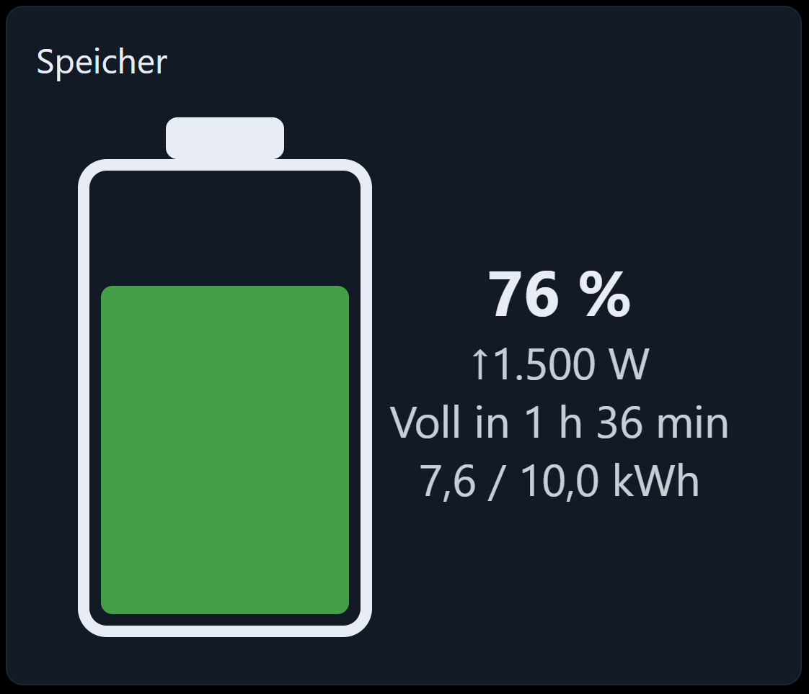

# Batteriespeicher



Ein Batteriesymbol, gefüllt nach dem Ladezustand, mit der Lade- oder Entladeleistung, einer Abschätzung, wie
lange das noch reicht, und der gespeicherten Energie.

## Voraussetzungen

Nur Live-Werte. Für das Symbol genügt der Ladezustand; Leistung und Kapazität ergänzen den Rest.

## Konfiguration

### Allgemein

| Feld                  | Bedeutung                                            |
| --------------------- | ------------------------------------------------------ |
| Ohne Rahmen / Name    | Karte und Titel                                       |
| Ausrichtung           | Das Symbol stehend oder liegend                       |
| Leistung anzeigen     | Die Zeile mit dem Pfeil unter dem Prozentwert         |
| Restlaufzeit anzeigen | „Voll in“ / „Leer in“. Benötigt die Kapazität.        |
| Nachkommastellen      | Nachkommastellen von Prozentwert und Leistung         |

### Werte

| Feld                        | Bedeutung                                                                   |
| --------------------------- | ---------------------------------------------------------------------------- |
| Ladezustand-OID             | Der SoC in Prozent                                                           |
| Multiplikator               | `100`, falls der Datenpunkt 0 … 1 statt 0 … 100 liefert                      |
| Laden und Entladen getrennt | Der Wechselrichter hat je einen Datenpunkt statt eines vorzeichenbehafteten  |
| Batterieleistung-OID        | Die vorzeichenbehaftete Leistung                                             |
| Ein positiver Wert bedeutet | Laden oder Entladen — die Wechselrichter sind sich hier nicht einig          |
| Ladeleistung-OID            | Größer als null, während die Batterie geladen wird                           |
| Entladeleistung-OID         | Größer als null, während die Batterie entladen wird                          |
| Multiplikator               | Skalierung der Leistung                                                      |
| Einheit der Leistung        | Üblicherweise `W` oder `kW`                                                  |
| Kapazität                   | Nutzbare Kapazität als feste Zahl                                            |
| Kapazität-OID               | …oder aus einem Datenpunkt, falls der Wechselrichter sie meldet. Hat Vorrang. |
| Einheit der Kapazität       | Üblicherweise `kWh`                                                          |

### Farben

| Feld                                  | Bedeutung                                                        |
| ------------------------------------- | ------------------------------------------------------------------ |
| Farbe nach Füllstand                  | Die Farbe an den beiden Schwellen wechseln statt einer festen Farbe |
| Untere Schwelle / Mittlere Schwelle   | In Prozent                                                         |
| Farbe bei niedrigem / mittlerem / hohem Stand | Bis zur unteren Schwelle, bis zur mittleren, darüber        |
| Füllfarbe                             | Die eine Farbe, wenn *Farbe nach Füllstand* aus ist                |

## Die Restlaufzeit

```
Laden:    (100 % − SoC) × Kapazität / |Leistung|
Entladen:          SoC  × Kapazität / |Leistung|
```

Die Kapazität ist eine Energie (kWh) und die Leistung eine Leistung (W oder kW) — beide müssen also
zusammenfinden: eine *Einheit der Leistung* von `W` wird vor der Division durch 1000 geteilt, jede andere
Einheit wird unverändert verwendet. Bei einer Kapazität in kWh setzen Sie die Einheit der Leistung daher auf
`W` oder `kW` — alles andere ergibt eine falsche Abschätzung.

Die Zahl ist eine Momentaufnahme bei der aktuellen Leistung, keine Prognose: sie ändert sich, sobald sich die
Last ändert.

## Rezept: ein 10-kWh-Speicher an einem Hybrid-Wechselrichter

1. *Ladezustand-OID* = der SoC-Datenpunkt, *Multiplikator* = `1`.
2. *Batterieleistung-OID* = die Batterieleistung, *Ein positiver Wert bedeutet* = `Laden` (probieren Sie
   `Entladen`, falls der Pfeil in die falsche Richtung zeigt), *Einheit der Leistung* = `W`.
3. *Kapazität* = `10`, *Einheit der Kapazität* = `kWh`.
4. *Farbe nach Füllstand* ein mit den Standardwerten: rot bis 20 %, orange bis 50 %, grün darüber.

## Fehlersuche

- **Der Pfeil zeigt in die falsche Richtung.** *Ein positiver Wert bedeutet* umstellen — oder im getrennten
  Modus die beiden Objekt-IDs tauschen.
- **Es wird keine Restlaufzeit angezeigt.** Die Kapazität fehlt, oder die Leistung ist genau 0 — solange die
  Batterie ruht, gibt es nichts abzuschätzen.
- **Die Restlaufzeit liegt um den Faktor 1000 daneben.** *Einheit der Leistung* und *Einheit der Kapazität*
  passen nicht zusammen. Bei einer Kapazität in kWh muss die Einheit der Leistung `W` oder `kW` sein.
- **Der Balken ist immer voll.** Der SoC-Datenpunkt liefert 0 … 1. *Multiplikator* auf `100` setzen.
