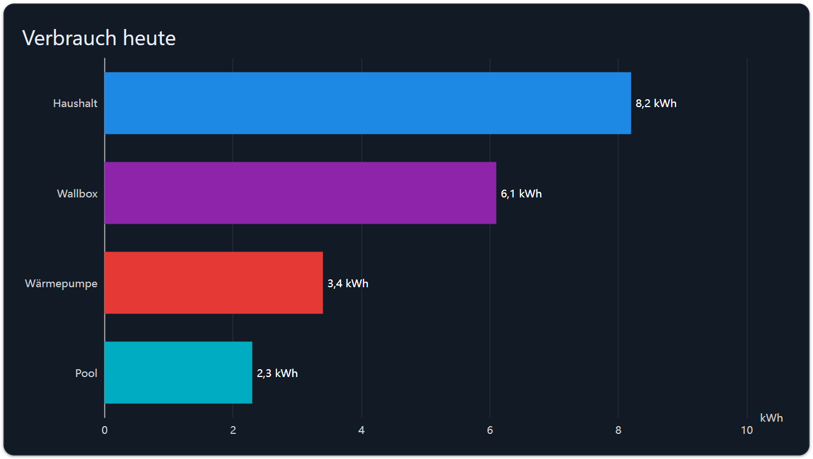
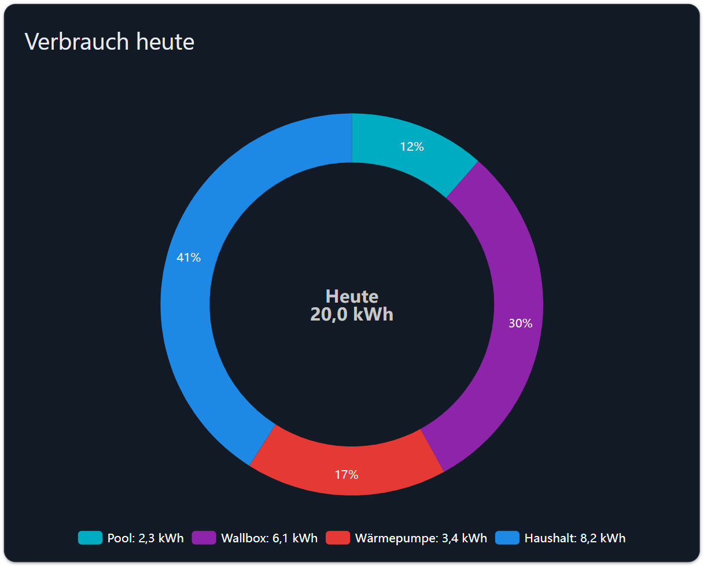

# Verbrauchsvergleich

Vergleicht die **aktuellen Werte** mehrerer Datenpunkte miteinander — als Balkendiagramm für eine Rangfolge
oder als Kuchendiagramm für die Anteile an einem Ganzen. Eine History-Instanz wird nicht gebraucht, die Werte
werden live gelesen.

## Konfiguration

### Allgemein

| Feld                | Bedeutung                                                      |
| ------------------- | ---------------------------------------------------------------- |
| Ohne Rahmen / Name  | Karte und Titel                                                  |
| Typ                 | Balken- oder Kuchendiagramm                                      |
| Geräte zählen       | Wie viele Datenpunkte verglichen werden, mindestens 2            |
| Sortierung          | Wie konfiguriert, größter Wert zuerst oder kleinster zuerst      |
| Nachkommastellen    | Nachkommastellen der Werte in Tooltip und Beschriftungen         |
| Keine Animation     | Sofort zeichnen statt animieren                                  |
| Animationsdauer     | In Millisekunden                                                 |

### Balkendiagramm

| Feld            | Bedeutung                                                    |
| --------------- | -------------------------------------------------------------- |
| Ausrichtung     | Waagerechte Balken (erstes Gerät oben) oder senkrechte          |
| Werte anzeigen  | Den Wert neben jeden Balken schreiben                           |

### Kuchendiagramm

| Feld              | Bedeutung                                                            |
| ----------------- | ---------------------------------------------------------------------- |
| Innenradius       | Größe des Lochs in der Mitte, in Prozent. 0 zeichnet einen vollen Kuchen. |
| Innerer Titel     | Text in der Mitte, oberhalb des inneren Wertes                          |
| Innere Objekt-ID  | Datenpunkt in der Mitte, z. B. die Summe                                |
| Innere Werteinheit| Direkt hinter dem inneren Wert                                          |
| Legende anzeigen  | Listet die Geräte mit ihren Werten unter dem Diagramm auf               |
| Höhe der Legende  | Wie viel der Höhe die Legende einnimmt, in Prozent                      |
| Versteckte Etiketten | Die Prozentwerte nicht in die Segmente schreiben                     |
| Etikettenpräzision| Nachkommastellen dieser Prozentwerte                                    |

### Ebene 1 … n

| Feld          | Bedeutung                                                                     |
| ------------- | ------------------------------------------------------------------------------- |
| OID           | Der Datenpunkt. Name und Farbe werden aus dem Objekt übernommen.                |
| Name          | Auf der Achse, in der Legende und im Tooltip                                    |
| Farbe         | Farbe des Balkens oder Segments                                                 |
| Einheit       | Leer lassen, dann wird die Einheit des Objekts verwendet                        |
| Multiplikator | Skalierung, z. B. `0.001` für Wh → kWh                                          |

## Einheiten

Jedes Gerät trägt seine **eigene** Einheit — Tooltip, Beschriftungen und Legende zeigen die Einheit dieses
Geräts, die x-Achse wird mit der ersten konfigurierten Einheit beschriftet.

> **Breaking Change in 2.0.0:** Dieses Widget rechnet W nicht mehr in Wh und kW nicht mehr in kWh um und
> dividiert Wh nicht mehr durch 1000. Es zeigt den echten Wert mit der echten Einheit. Zeigt Ihr Dashboard
> plötzlich 1000-fach größere Werte, setzen Sie den *Multiplikator* dieses Geräts auf `0.001`.
>
> Bis Version 2.0.1 wurden die Einheiten der Geräte vertauscht, sobald mehr als eine Einheit im Spiel war: das
> Diagramm zeichnet die Geräte in umgekehrter Reihenfolge, suchte die Einheit aber über die Zeichenposition.
> Behoben.

## Rezept: Wo bleibt der Strom?

1. *Typ* = `Kuchendiagramm`, *Innenradius* = `55`, *Geräte zählen* = `4`.
2. Ebene 1 … 4 = der Tagesverbrauch von Haushalt, Wärmepumpe, Wallbox und Pool.
3. *Innere Objekt-ID* = der Gesamtverbrauch des Tages, *Innerer Titel* = `Heute`.
4. *Legende anzeigen* ein, damit auch die absoluten Werte lesbar sind.

## Fehlersuche

- **Ein Gerät zeigt 0.** Seine Objekt-ID ist nicht gesetzt, oder der Datenpunkt hat noch keinen Wert.
- **Die Prozentwerte ergeben nicht 100.** *Etikettenpräzision* rundet sie; der Kuchen selbst ist exakt.
- **Falsche Einheit an einem Balken.** Setzen Sie *Einheit* am Gerät ausdrücklich, statt sich auf das Objekt zu
  verlassen.
