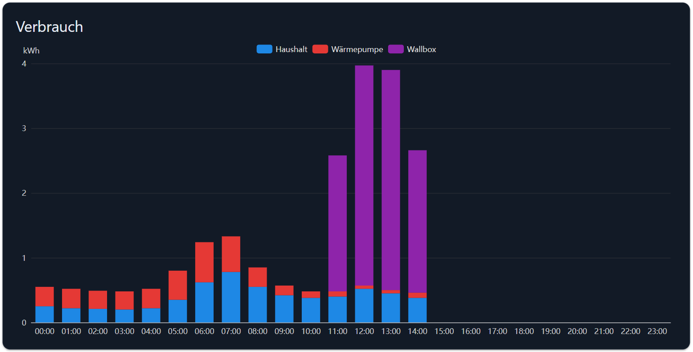

# Verbrauch

Ein Balken (oder eine Linie) je Stunde, Tag, Wochentag oder Monat des gewählten Zeitraums, für mehrere
Datenpunkte gleichzeitig. Die Daten kommen aus einer History-Instanz — dies ist das einzige Widget des Sets,
das eine braucht.

## Voraussetzungen

- Eine **History-Instanz** (`history`, `sql`, `influxdb`). Verwendet wird die Standard-History-Instanz aus den
  ioBroker-Systemeinstellungen.
- Die Datenpunkte müssen von dieser Instanz **aufgezeichnet** werden — das Logging in den Objekteinstellungen
  einschalten.
- Ein Zeitraum, siehe [Der Zeitraum](README.md#der-zeitraum).

## Wie aus einem Zeitraum Balken werden

| Zeitraum | Balken                   | Beschriftung |
| -------- | ------------------------ | ------------ |
| Tag      | 24, einer je Stunde       | `HH:00`      |
| Woche    | 7, einer je Tag           | `Mo` …       |
| Monat    | 28–31, einer je Tag       | `DD.MM`      |
| Jahr     | 12, einer je Monat        | `Jan` …      |

Die History-Instanz wird nach genau so vielen aggregierten Werten gefragt. Was in einen Balken kommt, bestimmt
*Aggregat*.

## Zähler oder Verbrauch?

Die meisten Energie-Datenpunkte in ioBroker sind **Zähler**: eine Zahl, die nur wächst, z. B. `1234,5 kWh` seit
der Installation. Ein Diagramm davon ist eine Treppe, kein Verbrauch.

Schalten Sie dafür **Differenz berechnen** ein. Das Widget liest dann einen zusätzlichen Abschnitt vor dem
Zeitraum und zeigt die Differenz zwischen zwei aufeinanderfolgenden Zählerständen — also den Verbrauch dieser
Stunde oder dieses Tages. Verwenden Sie es zusammen mit *Aggregat* = `max`.

Lassen Sie es aus, wenn der Datenpunkt bereits den Verbrauch eines Zeitraums enthält (etwa etwas, das der
`statistics`-Adapter erzeugt hat).

## Konfiguration

### Allgemein

| Feld                            | Bedeutung                                                                     |
| ------------------------------- | ------------------------------------------------------------------------------ |
| Ohne Rahmen / Name              | Karte und Titel                                                                |
| Diagrammtyp                     | Balken, Linien oder gefüllte Linien                                            |
| Balken gestapelt                | Die Reihen übereinander statt nebeneinander                                    |
| Legende anzeigen                | Die Namen der Reihen über dem Diagramm                                         |
| Werkzeugleiste anzeigen         | Die kleinen Symbole zum Umschalten der Stapelung und zum Öffnen der Datentabelle |
| Nachkommastellen                | Nachkommastellen im Tooltip                                                    |
| Geräte zählen                   | Wie viele Datenpunkte gezeichnet werden                                        |
| Widget zur Zeitintervallauswahl | Der [Intervallwähler](interval-selector.md), dem dieses Diagramm folgt          |
| OID starten / Intervall-OID     | Zeitraum aus zwei Datenpunkten, wenn kein Wähler-Widget verwendet wird          |

### Aggregation

| Feld                    | Bedeutung                                                                                      |
| ----------------------- | ------------------------------------------------------------------------------------------------ |
| Aggregat                | Wie die History-Instanz einen Balken zusammenfasst: `max`, `min`, `average`, `total`, `integral`, … |
| Differenz berechnen     | Siehe [oben](#zähler-oder-verbrauch). Nur bei `max`, `min`, `average`, `none`, `integral`          |
| Perzentil / Quantil     | Parameter der jeweiligen Aggregation                                                              |
| Integrale Einheit       | Zeiteinheit des Integrals in Sekunden, z. B. `3600` für eine Stunde                                |
| Integrale Interpolation | Wie die Lücken zwischen zwei Messwerten beim Integrieren gefüllt werden                            |

### Wert 1 … n

| Feld          | Bedeutung                                                                             |
| ------------- | -------------------------------------------------------------------------------------- |
| OID           | Der aufgezeichnete Datenpunkt. Name, Farbe und Einheit werden aus dem Objekt übernommen. |
| Name          | In Legende und Tooltip                                                                  |
| Farbe         | Farbe der Reihe                                                                         |
| Einheit       | Im Tooltip; die erste konfigurierte Einheit beschriftet auch die y-Achse                 |
| Multiplikator | Skalierung, z. B. `0.001` für Wh → kWh                                                  |

## Rezept: Haushalt, Wärmepumpe und Wallbox pro Tag

1. *Geräte zählen* = 3, *Balken gestapelt* ein.
2. *Aggregat* = `max`, *Differenz berechnen* ein — alle drei sind Zählerstände.
3. Wert 1 = der Haushaltszähler, Wert 2 = der Wärmepumpenzähler, Wert 3 = der Wallbox-Zähler.
4. Einen [Intervallwähler](interval-selector.md) darüber platzieren und in *Widget zur Zeitintervallauswahl*
   auswählen.

## Fehlersuche

- **Das Diagramm bleibt leer.** Die History-Instanz zeichnet diesen Datenpunkt nicht auf, oder in den
  Systemeinstellungen ist keine Standard-History-Instanz gesetzt. Das Widget wartet 10 s auf eine Antwort und
  zeigt dann nichts — eine fehlende History-Instanz antwortet nämlich nie.
- **Eine Treppe statt eines Verbrauchs.** *Differenz berechnen* einschalten.
- **Ein Balken ist viel zu groß.** Der Zähler wurde zurückgesetzt, die Differenz zum vorigen Stand ist daher
  riesig. Eine negative Differenz begrenzt das Widget auf 0, ein Rücksetzen erzeugt aber trotzdem einen
  falschen Balken im Abschnitt danach.
- **Die aktuelle Stunde fehlt.** Das war bis 2.0.1 ein Fehler: im Differenzmodus fiel der letzte Abschnitt des
  Zeitraums weg. Behoben.
- **Der Februar hatte 31 Balken.** Ebenfalls behoben — die Monatslänge stammte vom Vormonat.
