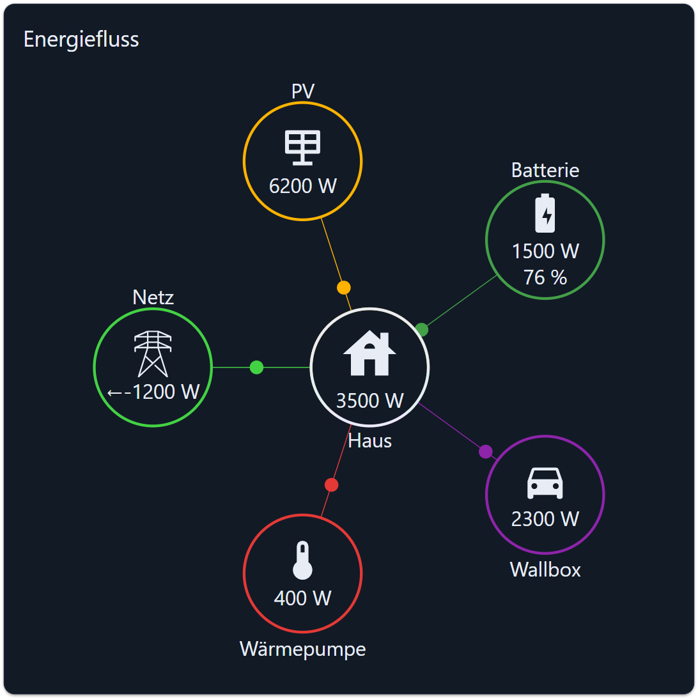

# Verteilung

Ein animiertes Flussdiagramm. Das Haus steht in der Mitte, der Netzanschluss und bis zu zehn weitere Knoten
(PV, Batterie, Wallbox, Wärmepumpe, Pool, …) liegen im Kreis darum. Auf jeder Verbindungslinie wandert ein
Punkt; seine Richtung zeigt, wohin die Energie fließt, seine Geschwindigkeit folgt dem Wert.

Der Ring um das Haus ist in Segmente geteilt, eines je Knoten, so groß wie dessen Anteil an der Summe.

## Voraussetzungen

Nur Live-Werte, keine History-Instanz. Ein Datenpunkt je Knoten, dazu einer für das Haus und einer für das Netz.

## Konfiguration

### Allgemein

| Feld                       | Bedeutung                                                                                       |
| -------------------------- | ------------------------------------------------------------------------------------------------ |
| Ohne Rahmen                | Ohne Karte zeichnen                                                                               |
| Name                       | Titel in der Kopfzeile der Karte                                                                  |
| Standardfarbe              | Farbe der Linien und Kreise ohne eigene Farbe                                                     |
| Standardkreisgröße         | In Prozent der Widget-Breite                                                                      |
| Standardabstandsgröße      | Abstand zwischen Haus und Knoten, in Prozent der Widget-Breite                                    |
| Standardschriftgröße       | In Pixeln. Ein Knoten mit eigener Schriftgröße hat Vorrang.                                       |
| Standardradiusgröße        | Radius für Kreise ohne eigene Größe, in Prozent der Widget-Breite                                 |
| Zusatzkreise               | Wie viele Knoten zusätzlich zum Netz gezeichnet werden                                            |
| Linienbreite               | Dicke der Kreise und der Segmente des Hausrings, in Pixeln                                        |
| Keine Animation            | Hält die wandernden Punkte an. Nützlich auf schwachen Tablets.                                    |
| Werte unverändert anzeigen | Schaltet die automatische Umrechnung ab, siehe [Einheiten](#einheiten)                            |

### Heimatkreis

| Feld                                        | Bedeutung                                                             |
| ------------------------------------------- | ---------------------------------------------------------------------- |
| Heimat-OID                                  | Der Verbrauch des Hauses. Name und Farbe werden automatisch übernommen. |
| Hausname                                    | Beschriftung unter dem mittleren Kreis                                  |
| Hausfarbe / Textfarbe                       | Farbe des Kreises und seiner Beschriftung                               |
| Standardsymbol / Benutzerdefiniertes Symbol | Symbol im Kreis. Ein eigenes Bild ersetzt das Standardsymbol.           |
| Größe des Heimkreises / der Heimentfernung / Schriftgröße | Überschreiben die Standardwerte für diesen Kreis          |
| Symbolgröße                                 | In Prozent der Kreisgröße                                               |
| Einheiten                                   | Leer lassen, um die Einheit des Datenpunkts zu verwenden                |
| Multiplikator / Runden                      | Skalierung und Nachkommastellen                                         |

### Stromleitungskreis

Alles vom Heimatkreis, dazu:

| Feld                      | Bedeutung                                                                                         |
| ------------------------- | -------------------------------------------------------------------------------------------------- |
| Stromleitung-OID          | Aus dem Netz bezogene Leistung. Ein **negativer** Wert bedeutet Einspeisung ins Netz.               |
| Stromleitungsrückgabe-OID | Eigener Datenpunkt für die Einspeisung, falls der Zähler beide Richtungen getrennt meldet           |
| Energiefarbe zurückgeben  | Farbe des Einspeisewertes im Kreis                                                                  |
| Ausblenden, wenn weniger als | Blendet den Kreis unterhalb dieses Wertes aus. Leer zeigt ihn immer. Im Editor bleibt er sichtbar. |
| Richtung umkehren         | Dreht die Richtung des wandernden Punktes um                                                        |
| Bewegungsgeschwindigkeit  | Je größer die Zahl, desto langsamer wandert der Punkt bei gleichem Wert                             |

### Knoten 1 … n

Dieselben Felder wie bei der Stromleitung, dazu:

| Feld           | Bedeutung                                                                             |
| -------------- | -------------------------------------------------------------------------------------- |
| OID 2          | Ein zweiter Wert im Kreis, z. B. der Ladezustand einer Batterie in Prozent              |
| OID 2 Einheit  | Leer lassen, um die Einheit dieses Datenpunkts zu verwenden                             |

## Einheiten

Ein Datenpunkt mit der Einheit `Wh` wird durch 1000 geteilt und als `kWh` angezeigt, ein Wert ganz ohne Einheit
bekommt `kWh` dahintergeschrieben. Das ist historisches Verhalten und bleibt erhalten, damit bestehende
Ansichten sich nicht ändern. Mit **Werte unverändert anzeigen** bekommen Sie Wert und Einheit des Datenpunkts
genau so, wie sie sind.

> Bis Version 2.0.1 wurde der Wert geteilt, die Einheit blieb aber `Wh` — 1500 Wh erschienen also als
> „1,5 Wh“. Die Einheit wird jetzt zusammen mit dem Wert korrigiert.

## Richtung des Punktes

Standardmäßig fließt ein **positiver** Wert zum Haus hin und ein negativer davon weg. Das passt zu einem
Netzzähler (positiv = Bezug) und zu einem PV-Wechselrichter (positiv = Erzeugung). Für einen Datenpunkt, der
andersherum zählt — etwa eine Batterie, die das Entladen negativ meldet — schalten Sie bei diesem Knoten
**Richtung umkehren** ein.

## Rezept: Netz, PV, Batterie und Wallbox

1. *Zusatzkreise* = 3.
2. *Stromleitung-OID* = der Netzzähler. *Stromleitungsrückgabe-OID* nur setzen, wenn die Einspeisung einen
   eigenen Datenpunkt hat.
3. Knoten 1: die PV-Erzeugung. Standardsymbol „Solarenergie“.
4. Knoten 2: die Batterieleistung. *OID 2* = der Ladezustand, *OID 2 Einheit* = `%`. *Richtung umkehren*
   einschalten, falls Ihr Wechselrichter das Laden negativ meldet.
5. Knoten 3: die Wallbox. *Ausblenden, wenn weniger als* = `50`, damit der Kreis verblasst, solange kein Auto
   lädt.

## Fehlersuche

- **Nichts bewegt sich.** Der Punkt wird nur gezeichnet, solange der Wert nicht 0 ist. Prüfen Sie außerdem
  *Keine Animation*.
- **Ein Kreis fehlt.** *Ausblenden, wenn weniger als* liegt über dem aktuellen Wert. Im Editor bleiben
  ausgeblendete Kreise sichtbar, damit sie noch konfiguriert werden können.
- **Alle Werte sind 1000-fach zu groß.** *Multiplikator* auf `0.001` setzen — oder *Werte unverändert
  anzeigen* ausschalten, wenn der Datenpunkt wirklich in Wh liegt.
- **Die Beschriftung eines Knotens ist abgeschnitten.** *Standardschriftgröße* verkleinern oder dem Knoten
  über *Entfernungsgröße* mehr Platz geben.
