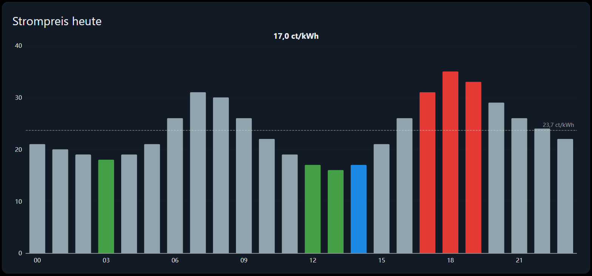

# Dynamischer Strompreis

Der stündliche Börsenpreis als Balkendiagramm. Die günstigsten Stunden sind grün, die teuersten rot, die
gerade laufende Stunde blau, und eine gestrichelte Linie markiert den Durchschnitt der angezeigten Stunden.

## Voraussetzungen

Ein Datenpunkt, der die Preise als **JSON-Array** enthält. Die Adapter, die Börsenpreise liefern, tun das alle
— aber jeder benennt die Felder anders. Das Widget erkennt die üblichen Namen von selbst:

| Adapter        | Typischer Datenpunkt    | Feld für die Zeit  | Feld für den Preis |
| -------------- | ----------------------- | ------------------ | ------------------ |
| `tibberlink`   | `…PricesToday.json`     | `startsAt`         | `total`            |
| `awattar`      | `…prices.json`          | `start_timestamp`  | `marketprice`      |
| `epex-spot`    | `…prices`               | `start`            | `price`            |
| `smartenergy`  | `…prices`               | `date`             | `value`            |

Akzeptiert werden:

- ein Array von Datensätzen, z. B. `[{ "startsAt": "2026-09-24T12:00:00+02:00", "total": 0.246 }, …]`,
- ein in ein Objekt verpacktes Array, z. B. `{ "prices": [ … ] }` (auch `today`, `data`, `values`, `result`),
- ein einfaches Array aus 24 Zahlen — dann als die Stunden des heutigen Tages ab Mitternacht gelesen.

Die Zeit darf eine ISO-Zeichenkette, ein Zeitstempel in Millisekunden oder einer in Sekunden sein.

Passt nichts davon, tragen Sie in **Feld für die Zeit** und **Feld für den Preis** die Namen ein, die Ihr
Adapter verwendet.

## Konfiguration

### Allgemein

| Feld                    | Bedeutung                                                                |
| ----------------------- | -------------------------------------------------------------------------- |
| Ohne Rahmen / Name      | Karte und Titel                                                            |
| Preise-OID              | Der Datenpunkt mit dem JSON-Array                                          |
| Feld für die Zeit       | Leer lassen, die üblichen Namen werden automatisch erkannt                 |
| Feld für den Preis      | Leer lassen, die üblichen Namen werden automatisch erkannt                 |
| Multiplikator           | `100` macht aus €/kWh Cent pro kWh, `1` lässt die Preise unverändert       |
| Einheit                 | Hinter jedem Preis, z. B. `ct/kWh`                                         |
| Nachkommastellen        | Nachkommastellen der Preise                                                |
| Anzahl der Stunden      | Wie viele Stunden gezeichnet werden. `0` zeigt alles, was der Datenpunkt hat. |
| Nur ab jetzt            | Die vergangenen Stunden weglassen                                          |
| Aktuellen Preis anzeigen| Der Preis der laufenden Stunde über dem Diagramm                           |
| Durchschnitt anzeigen   | Die gestrichelte Linie                                                     |

### Farben

| Feld                                  | Bedeutung                                                        |
| ------------------------------------- | ------------------------------------------------------------------ |
| Hervorhebung                          | Wie günstig und teuer bestimmt werden, siehe unten                 |
| Günstigste Stunden / Teuerste Stunden | Wie viele Stunden die jeweilige Farbe bekommen (Modus „die n …“)   |
| Toleranz                              | Prozentuale Abweichung vom Durchschnitt (Modus „Abstand zum …“)    |
| Farbe günstig / normal / teuer        | Die drei Farben                                                    |
| Farbe der aktuellen Stunde            | Die laufende Stunde. Sie hat Vorrang vor der Hervorhebung.         |

## Die beiden Hervorhebungsmodi

**Die n günstigsten und teuersten** bildet eine Rangfolge der angezeigten Stunden und färbt die ersten n und
die letzten n. Damit beantworten Sie „wann soll die Spülmaschine heute Abend laufen“.

**Abstand zum Durchschnitt** färbt eine Stunde, wenn sie mehr als *Toleranz* Prozent unter oder über dem
Durchschnitt der angezeigten Stunden liegt. Damit sehen Sie, wie ungewöhnlich der heutige Tag ist.

**Keine** zeichnet alle Balken in der normalen Farbe; die aktuelle Stunde bleibt trotzdem hervorgehoben.

## Rezept: wann das Auto laden?

1. *Preise-OID* = das Preis-Array Ihres Tarif-Adapters, *Multiplikator* = `100`, *Einheit* = `ct/kWh`.
2. *Nur ab jetzt* ein, *Anzahl der Stunden* = `12`.
3. *Hervorhebung* = `Die n günstigsten und teuersten`, *Günstigste Stunden* = `4`, *Teuerste Stunden* = `0`.

Die vier grünen Balken sind die vier günstigsten der nächsten zwölf Stunden.

## Fehlersuche

- **„Keine Preise gefunden.“** Der Datenpunkt ist leer, kein gültiges JSON, oder die Datensätze verwenden
  Feldnamen, die das Widget nicht kennt. Schauen Sie sich den Wert im Objektbrowser an und tragen Sie *Feld
  für die Zeit* und *Feld für den Preis* ein.
- **Die Preise liegen um den Faktor 100 daneben.** Ihr Adapter liefert €/kWh und Sie möchten Cent, oder
  umgekehrt. *Multiplikator* setzen.
- **Alle Balken sind grau.** *Hervorhebung* steht auf `Keine`, oder bei „Abstand zum Durchschnitt“ ist die
  *Toleranz* so groß, dass keine Stunde sie erreicht.
- **Das Diagramm ist abends leer.** *Nur ab jetzt* lässt die Vergangenheit weg, und die Preise für morgen
  werden meist erst am frühen Nachmittag veröffentlicht. Bleibt nichts übrig, zeigt das Widget wieder alles.
- **Die aktuelle Stunde ist nicht hervorgehoben.** Der Balken ist nur blau, solange die laufende Stunde im
  angezeigten Fenster liegt — bei *Nur ab jetzt* ist sie die erste.
