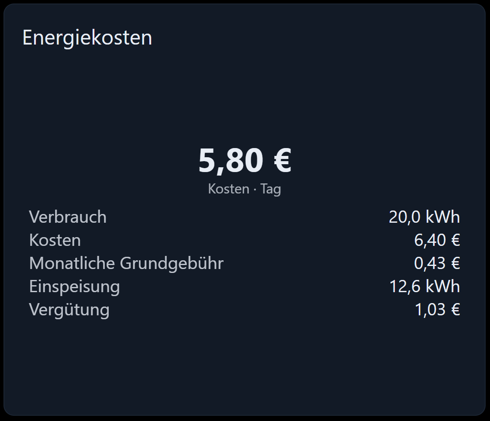

# Energiekosten



Was die Energie des angezeigten Zeitraums kostet: Verbrauch × Preis, dazu der Anteil der monatlichen
Grundgebühr, abzüglich der Einspeisevergütung. Ergebnis ist eine große Zahl, darunter die Aufschlüsselung.

## Woher die Energiemenge kommt

Das Attribut **Woher die Energiemenge kommt** entscheidet darüber — und es ist die eine Einstellung, die man
richtig treffen muss:

### Wert des Datenpunkts

Die Zahl im Datenpunkt wird genommen, wie sie ist. Der Datenpunkt selbst muss also die Menge des angezeigten
Zeitraums enthalten — etwa ein „Verbrauch heute“ aus dem `statistics`-Adapter.

Die Zeitraumauswahl *beschriftet* das Ergebnis dann nur und bestimmt, wie die monatliche Grundgebühr verteilt
wird. Sie ändert die Energiemenge nicht. „Jahr“ anzuzeigen, während der Datenpunkt den heutigen Verbrauch
enthält, ergibt eine falsche Zahl.

### Summe aus der History

Das Widget liest den Zeitraum selbst aus der History-Instanz, genau wie das [Verbrauch](consumption.md)-Widget,
und addiert die Abschnitte. Richten Sie *Energie-OID* auf den **Zählerstand** und lassen Sie *Differenz
berechnen* eingeschaltet; die Summe der Differenzen ist der Verbrauch des Zeitraums.

Das ist der Modus, in dem die Zeitraumauswahl wirklich wirkt: der Wechsel von Tag auf Monat ändert die Zahl.

## Voraussetzungen

- Für „Summe aus der History“: eine History-Instanz, die die beiden Zähler aufzeichnet.
- Für „Wert des Datenpunkts“: nichts außer den Datenpunkten.
- Ein Zeitraum, siehe [Der Zeitraum](README.md#der-zeitraum).

## Konfiguration

### Allgemein

| Feld                             | Bedeutung                                                          |
| -------------------------------- | -------------------------------------------------------------------- |
| Ohne Rahmen / Name               | Karte und Titel                                                      |
| Woher die Energiemenge kommt     | Siehe oben                                                           |
| Währung                          | Hinter jedem Betrag, z. B. `€`                                       |
| Einheit der Energie              | Einheit der Energiemenge. Der Preis ist ein Preis *je dieser Einheit*. |
| Nachkommastellen / …der Energie  | Nachkommastellen der Beträge und der Energiemengen                   |
| Aufschlüsselung anzeigen         | Die Tabelle unter der großen Zahl                                    |
| Energiemengen mit anzeigen       | Ergänzt in dieser Tabelle die kWh, aus denen die Beträge entstanden   |
| Farbe der Kosten / der Gutschrift| Farbe der großen Zahl beim Zahlen bzw. beim Erhalten                  |

### Verbrauch

| Feld                     | Bedeutung                                                                         |
| ------------------------ | ----------------------------------------------------------------------------------- |
| Energie-OID              | Die verbrauchte Energie, im History-Modus der Zählerstand                            |
| Multiplikator            | Skalierung, z. B. `0.001` für Wh → kWh                                               |
| Preis                    | Preis je Energieeinheit, z. B. `0.30`                                                |
| Preis-OID                | Ein Datenpunkt mit dem aktuellen Preis, für einen dynamischen Tarif. Hat Vorrang.     |
| Monatliche Grundgebühr   | Fester Betrag pro Monat, auf den angezeigten Zeitraum verteilt                        |

### Einspeisung

| Feld                      | Bedeutung                                                     |
| ------------------------- | --------------------------------------------------------------- |
| Einspeisung-OID           | Ins Netz eingespeiste Energie. Leer lassen, wenn es keine gibt.   |
| Multiplikator             | Skalierung                                                      |
| Einspeisevergütung        | Womit eine Einheit vergütet wird, z. B. `0.08`                   |
| Einspeisevergütung-OID    | …oder aus einem Datenpunkt. Hat Vorrang vor dem festen Wert.      |

### Zeitraum

| Feld                            | Bedeutung                                                      |
| ------------------------------- | ---------------------------------------------------------------- |
| Widget zur Zeitintervallauswahl | Der [Intervallwähler](interval-selector.md), dem gefolgt wird     |
| OID starten / Intervall-OID     | Zeitraum stattdessen aus zwei Datenpunkten                        |
| Aggregat                        | Nur im History-Modus, siehe [Verbrauch](consumption.md)           |
| Differenz berechnen             | Nur im History-Modus. Bei Zählerständen einschalten.              |

## Die Grundgebühr

Die Grundgebühr wird **pro Monat** eingetragen und auf den angezeigten Zeitraum verteilt: ein Tag bekommt ein
Dreißigstel davon (genau: eins geteilt durch die Anzahl der Tage dieses Monats), eine Woche sieben dieser Tage,
ein Monat alles und ein Jahr das Zwölffache.

## Der Saldo

```
Saldo = Verbrauch × Preis + Anteil der Grundgebühr − Einspeisung × Einspeisevergütung
```

Ein positiver Saldo erscheint als **Kosten** in der Kostenfarbe, ein negativer als **Gutschrift** in der
Gutschriftfarbe.

## Rezept: die Kosten des laufenden Monats

1. *Woher die Energiemenge kommt* = `Summe aus der History`, *Differenz berechnen* ein.
2. *Energie-OID* = der Zählerstand des Hauses, *Einspeisung-OID* = der Einspeisezähler.
3. *Preis* = `0.32`, *Einspeisevergütung* = `0.082`, *Monatliche Grundgebühr* = `12.90`.
4. Einem [Intervallwähler](interval-selector.md) folgen und diesen auf „Monat“ stellen.

## Rezept: ein dynamischer Tarif

Richten Sie *Preis-OID* auf den aktuellen Preis Ihres Tarif-Adapters (tibberlink, awattar, …) und stellen Sie
das Widget neben das Diagramm [Dynamischer Strompreis](dynamic-price.md). Beachten Sie, dass die Kosten dann
mit dem Preis *dieses Augenblicks* über den ganzen Zeitraum gerechnet werden — eine exakte stundengenaue
Abrechnung ist Aufgabe des Tarif-Adapters selbst.

## Fehlersuche

- **Die Zahl ändert sich nicht, wenn ich den Zeitraum wechsle.** Sie sind im Modus „Wert des Datenpunkts“, in
  dem der Zeitraum das Ergebnis nur beschriftet. Wechseln Sie auf „Summe aus der History“.
- **Die Kosten sind im History-Modus viel zu hoch.** *Differenz berechnen* ist aus, obwohl der Datenpunkt ein
  Zählerstand ist — es wurden also Zählerstände statt Verbräuche summiert.
- **Es wird gar nichts angezeigt.** Die History-Instanz zeichnet diesen Datenpunkt nicht auf, oder
  *Energie-OID* ist nicht gesetzt.
- **Die Grundgebühr sieht falsch aus.** Sie gilt pro Monat, nicht pro Zeitraum. Ein Tag zeigt absichtlich nur
  ein Dreißigstel.
