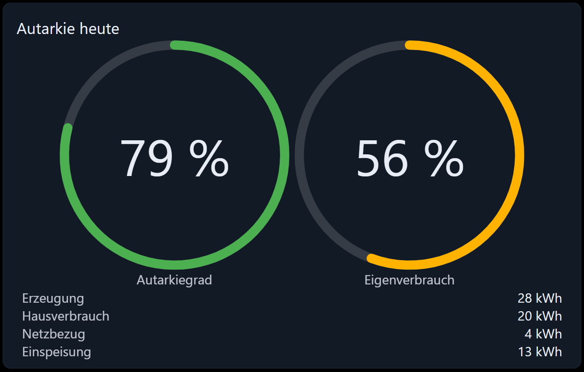

# Autarkie



Zwei Ringe, die die beiden Fragen beantworten, die sich jeder PV-Besitzer stellt:

- **Autarkiegrad** — wie viel von dem, was das Haus verbraucht hat, *nicht* aus dem Netz kam.
- **Eigenverbrauch** — wie viel von dem, was die PV erzeugt hat, im Haus genutzt statt verkauft wurde.

Beides sind Verhältnisse, sie funktionieren also mit Leistung (ein Live-Bild) genauso wie mit Energiezählern
eines Zeitraums — solange alle Eingänge **dieselbe Einheit** haben.

## Die Formeln

```
Hausverbrauch  = Erzeugung − Einspeisung + Netzbezug      (sofern kein eigener Datenpunkt gesetzt ist)
Eigenverbrauch = Erzeugung − Einspeisung
Autarkiegrad   = (Hausverbrauch − Netzbezug) / Hausverbrauch
Eigenverbrauchsquote = Eigenverbrauch / Erzeugung
```

Beide Ergebnisse werden auf 0 … 100 % begrenzt, und ein Ring zeigt `--`, solange sein Nenner 0 ist (nachts gibt
es zum Beispiel keine Erzeugung).

## Voraussetzungen

Nur Live-Werte. Mindestens die Erzeugung und das Netz; der Hausverbrauch ergibt sich dann aus der Bilanz.

Alle Datenpunkte müssen dieselbe Einheit haben: mischen Sie keinen PV-Wechselrichter in W mit einem Zähler in
kW. Verwenden Sie dafür den **Multiplikator** neben jeder Objekt-ID.

## Konfiguration

### Allgemein

| Feld                      | Bedeutung                                                                   |
| ------------------------- | ---------------------------------------------------------------------------- |
| Ohne Rahmen / Name        | Karte und Titel                                                              |
| Anzeigen                  | Beide Ringe, nur Autarkiegrad oder nur Eigenverbrauch                        |
| Werte anzeigen            | Listet Erzeugung, Hausverbrauch, Netzbezug und Einspeisung unter den Ringen  |
| Einheit                   | Hinter diesen aufgelisteten Werten, z. B. `W` oder `kWh`                     |
| Nachkommastellen          | Nachkommastellen der Prozentwerte und der aufgelisteten Werte                |
| Ringdicke                 | Breite des Rings in Pixeln                                                   |
| Farbe Autarkiegrad        | Gefüllter Teil des linken Rings                                              |
| Farbe Eigenverbrauch      | Gefüllter Teil des rechten Rings                                             |
| Farbe der Ringbahn        | Der leere Teil des Rings. Leer folgt dem Theme.                              |

### Datenquellen

| Feld                          | Bedeutung                                                                       |
| ----------------------------- | --------------------------------------------------------------------------------- |
| Erzeugung-OID                 | Was die PV-Anlage erzeugt                                                          |
| Ein Datenpunkt für das Netz   | Der Zähler liefert einen vorzeichenbehafteten Wert für beide Richtungen             |
| Netz-OID                      | Dieser Wert: positiv ist Bezug aus dem Netz, negativ ist Einspeisung                |
| Netzbezug-OID                 | Was aus dem Netz bezogen wird (wenn der Zähler die Richtungen trennt)               |
| Einspeisung-OID               | Was ins Netz eingespeist wird                                                       |
| Hausverbrauch-OID             | Optional. Ohne ihn wird der Verbrauch aus den anderen drei berechnet.               |
| Multiplikator (dreimal)       | Je einer für Erzeugung, Netz und Hausverbrauch                                      |

## Rezept: ein Live-Bild in W

1. *Erzeugung-OID* = die AC-Leistung des Wechselrichters.
2. *Ein Datenpunkt für das Netz* ein, *Netz-OID* = die Leistung des Netzzählers (positiv = Bezug).
3. *Hausverbrauch-OID* leer lassen — er ergibt sich aus der Bilanz.
4. *Werte anzeigen* ein, *Einheit* = `W`.

## Rezept: die Quote eines Tages

Nehmen Sie stattdessen Tages-Energiezähler: Erzeugung des Tages, Netzbezug des Tages, Einspeisung des Tages.
Die beiden Ringe zeigen dann die Quote dieses Tages statt die dieser Sekunde. Alles in kWh, alle
Multiplikatoren auf `1`.

## Fehlersuche

- **Ein Ring zeigt `--`.** Sein Nenner ist 0. Der Eigenverbrauch braucht eine Erzeugung größer 0, der
  Autarkiegrad einen Hausverbrauch größer 0.
- **Der Autarkiegrad ist immer 100 %.** Der Netzbezug ist nicht konfiguriert oder 0. Prüfen Sie bei einem
  einzelnen vorzeichenbehafteten Netz-Datenpunkt, ob Ihr Zähler wirklich positiv für „Bezug“ verwendet — wenn
  es andersherum ist, nehmen Sie die beiden getrennten Objekt-IDs.
- **Die Zahlen passen nicht zusammen.** Ein Eingang hat eine andere Einheit. Prüfen Sie die drei
  Multiplikatoren.
